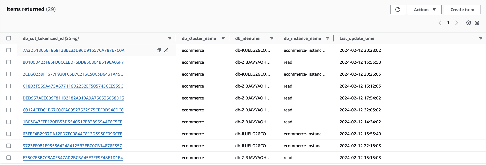
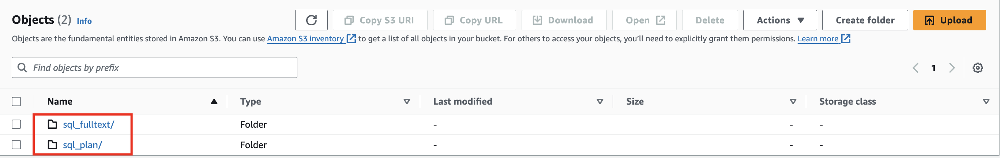
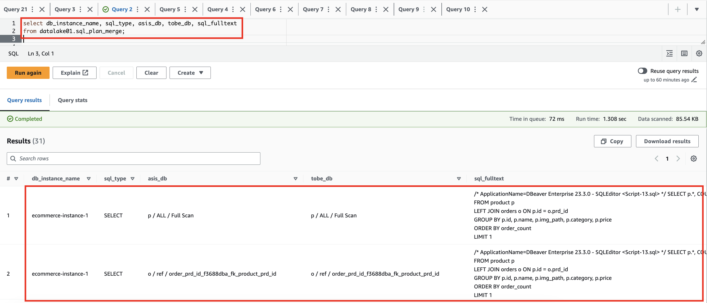
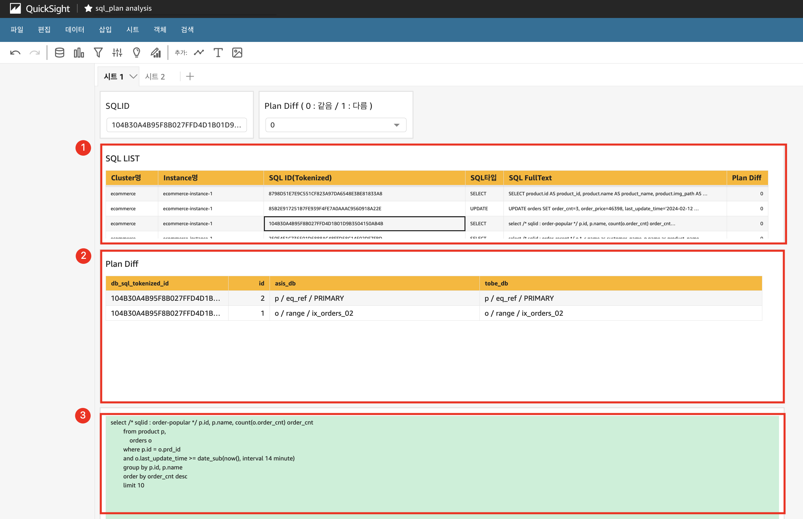

## 목적
DB(MySQL) 메이저 버전 업그레이드 시 서비스 영향도를 최소화하기 위해 SQL전수검사, Front 화면 데이터 QA, 최종 DB Switch 전략 등 다양한 사전 준비 과정이 필요합니다. 그 중 SQL 전수 검사는 필수로 진행되어야 하지만 많은 시간과 노력이 필요합니다. 본 아키텍처는 보다 효율적이고 체계적으로 SQL 체크를 할 수 있도록 돕기 위해 구성되었습니다.

각 단계를 요약하면 아래와 같습니다.
1. Performance Insight API를 활용하여 Tokenized 된 SQL를 중복없이 수집
1. 각 DB버전(v5.7, v8)에서 SQL Plan 수행
1. SQL 과 Plan 결과를 S3에 저장
1. Athena를 통한 질의 또는 QuickSight 통해 UI 인터페이스로 손쉽게 영향도 확인

데이터베이스 버전 업그레이드 시 아래와 같이 활용할 수 있습니다.
1. TOBE DB 버전에서 문법 또는 버전 차이로 오류가 발생될 SQL 사전 식별, 수정
1. TOBE DB 버전에서 성능 차이가 발생될 SQL 사전 식별, 수정

## Architecture

## Service 구성

### Lambda
- sql_gather.py
    - Performance Insight API 를 통해 SQL를 S3로 수집
- sql_plan.py
    - S3 에 수집된 SQL 을 각 버전의(v5.7, v8.0) DB에서 Plan 수행 후 결과를 S3로 수집

### DynamoDB
중복 SQL이 수집되지 않도록 SQL Tokenized ID 를 저장 및 체크

### S3
- sql_fulltext/
    - SQL 수집
- sql_plan/
    - SQL Plan 결과 수집

### Athena
SQL를 통해 데이터 조회

### QuickSight
1. 전체 SQL 리스트, Plan Diff 확인
1. 각 DB 버전에서의 Plan 결과 및 차이 확인
1. SQL FullText 확인

